# はじめに

GitHub で [Mermaid](http://mermaid-js.github.io/mermaid/) がサポートされました。
https://github.blog/2022-02-14-include-diagrams-markdown-files-mermaid/

Mermaid は図やグラフを描画するの独自の記法を持ちます。
その記法を Markdown のコードブロック中に記述するだけで図を描画できるのが便利です。
...便利なのですが、記法が独特なことや機能が豊富なことから、とっつきにくいところもあります。

弊社[^1]では [みんチャレ](https://minchalle.com) 開発の情報共有ツールとして [esa.io](https://esa.io) を活用しており、 esa も Mermaid をサポートしており以前から活用していました。
この記事では、私がこれまでに活用してきた中から特に便利だと感じた機能を紹介します。

[^1]: https://a10lab.com

ちなみに Zenn も Mermaid をサポートしているため図を描画できます。

# Gantt

ガントチャートです。
私が Mermaid を使いたいと思ったきっかけの機能です。

まずは、一番シンプルな例を書きます。

```
gantt
  Completed task :crit, done,    t1, 2022-01-03, 3d
  Active task    :      active,  t2, after t1,   3d
  Future task    :               t3, after t2,   5d
  Future task2   :                               3d
```

↓のように描画されます。

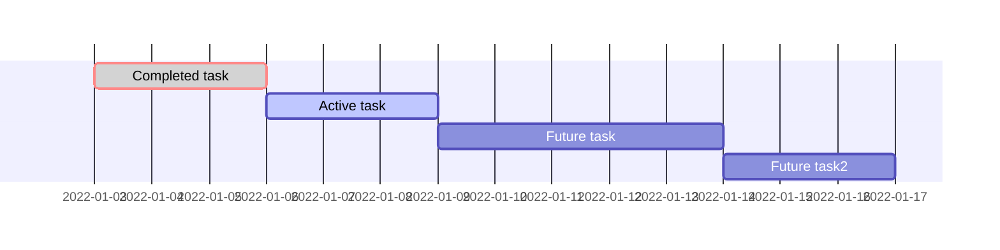

記法をざっくり説明すると、

```
  タスク名 :crit(省略可), done もしくは active(省略可), 識別子(省略可), start(省略可), end もしくは length
```

となります。
省略可能な記述が多いため、これじゃ動かないだろと思ったら動いたり、動くと思ったら動かないことがあるかもしれません。
JavaScript に慣れている人なら、関数の `arguments` [^2] の要素数に応じて処理を変えるアレみたいなもん、という感覚で理解できる...かも？

[^2]: 今は `...args` などと[残余引数](https://developer.mozilla.org/ja/docs/Web/JavaScript/Reference/Functions/rest_parameters)を使うことが一般的なんでしょうか

## タスクとタスクの関連付け

Mermaid のガントチャートが便利なところは、タスクとタスクの関連付けが簡単なところです。
`after 識別子` と書くと、その識別子のタスクの後続として行なうタスクとして認識されます。
何も書かなければ、前の行のタスクの後続として認識されます。
うまく使えば「task1の完了が2日遅れると、他のタスクにどれくらい影響が出るのか」がひと目で分かるようになります。

ちなみに after は複数指定できます。

```
gantt
  Completed task :done,    t1, 2022-01-03,  3d
  Active task    :active,  t2, after t1,    3d
  Future task    :         t3, after t1,    1d
  Future task2   :             after t2 t3, 3d
```

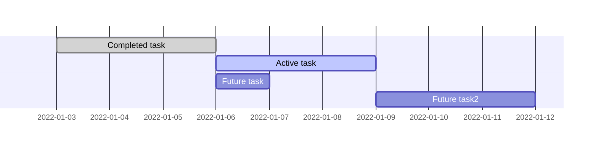

### 識別子の注意点1: `taskN` は使わない方が無難

タスクの識別子を `task1` などとしたくなる気持ちは抑えましょう。
Mermaid は識別子のデフォルト値を持っていて、それらが `task1` や `task2` といった文字列になっています。
https://github.com/mermaid-js/mermaid/blob/d818551f5068b93e50d69e573b6b8d8f3726669c/src/diagrams/gantt/ganttDb.js#L260-L266

言い換えると、識別子を定義してなくても `after task1` と書くと機能します。
とはいえ、上から順番に割り振られているため、並び替えると途端に破綻するので使わない方が安全です。

```
gantt
  Completed task :done,   2022-01-03,  3d
  Active task    :active,              3d
  Future task    :        after task1, 1d
```

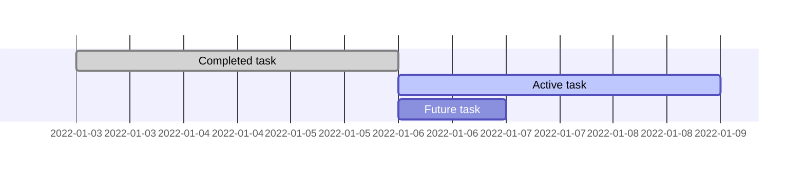

### 識別子の注意点2: 識別子は全部書いた方が無難

識別子を定義した場合は `start` の指定が必要です。
Mermaid はタスクに設定されている項目の数に応じて処理を変えているため、

```
  タスク名: t1, 3d
```

のように項目が 2つだった場合は、 `start` と `end もしくは length` が設定されているものとみなします。
すると t1 が `start` を示していると解釈するのですが、 t1 は日時に変換できず `after` でもないためパースエラーとなり、デフォルト値 ( `new Date()` ) が使われます。

`start` は直前のタスク完了後にしたい場合は、これが非常に面倒くさいのですが直前のタスクの識別子に対する `after` を書く必要があります。
なのでもう、識別子は全部のタスクに書いておいた方が後が楽です。

## グループ化

section を使うとグループを区切ることができます。

```
gantt
  section Aチーム
  Completed task :done,   2022-01-03, 3d
  Active task    :active,             3d
  Future task    :                    1d

  section Bチーム
  Completed task :done,   2022-01-03, 2d
  Active task    :active,             1d
  Future task    :                    1d
```

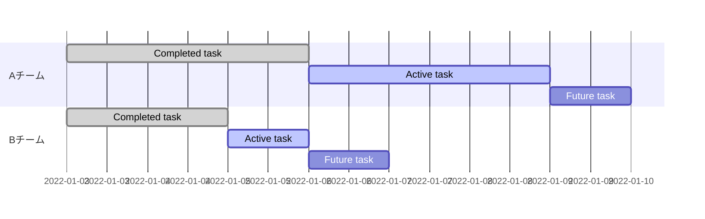

識別子は section 間を共有します。
そのため、Aチームのタスクが完了したら Bチームのタスクが進められる、といったことが表現できます。

```
gantt
  section Aチーム
  Completed task :done,   a1, 2022-01-03, 3d
  Active task    :active, a2, after a1,   3d
  Future task    :        a3, after a2,   1d

  section Bチーム
  Completed task :done,   b1, 2022-01-03, 2d
  Active task    :active, b2, after b1,   1d
  Future task    :        b3, after a2,   1d
```

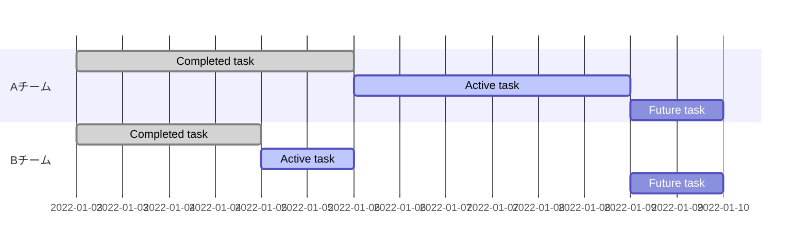

## 休日を考慮する

今まで書いてきたガントチャートは休日が考慮されていません。
土日祝日関係なく作業している前提になっています。
例えば↓の場合、 01/08 と 01/09 は土日なのですが作業時間として割り当てられています。

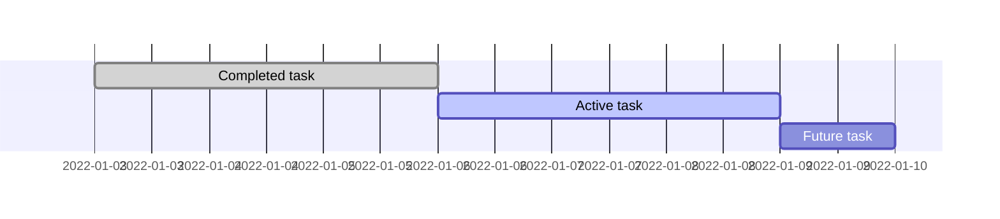

ここで `excludes` を利用すると良い感じに調整されます。
とにかく、土日は休みましょう。

```
gantt
  excludes weekends

  Completed task :done,   a1, 2022-01-03, 3d
  Active task    :active, a2, after a1,   3d
  Future task    :        a3, after a2,   1d
```

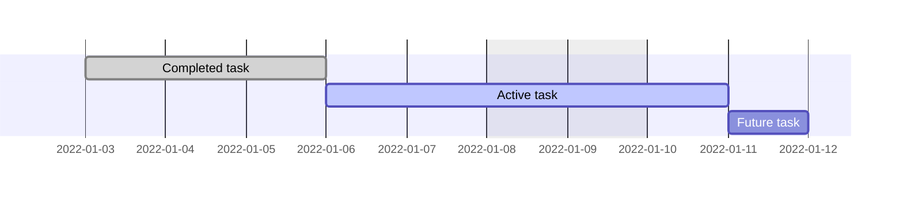

`excludes weekends` を設定することで Active task は 01/06, 01/07 土日を挟んで 01/10 の3日間に作業するよう調整できました。
01/07 も休むことにします。

```
gantt
  dateFormat YYYY-MM-DD
  excludes 2022-01-07, weekends

  Completed task :done,   a1, 2022-01-03, 3d
  Active task    :active, a2, after a1,   3d
  Future task    :        a3, after a2,   1d
```

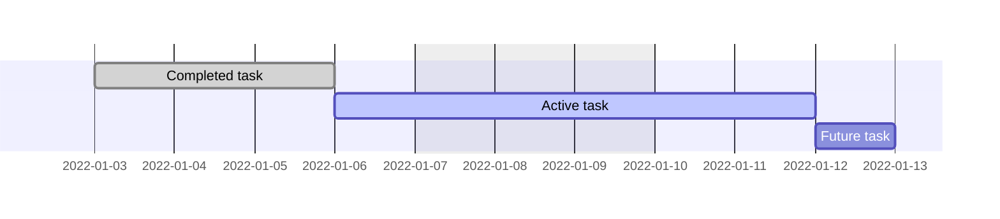

`excludes` で日付を指定する場合は `dateFormat` が必須です。

## その他

`title` でタイトルをつけたり `axisFormat` で日付の文字列を変更できたりします。

```
gantt
  title ガントチャートのサンプル
  axisFormat %m/%d
  dateFormat YYYY-MM-DD
  excludes 2022-01-07, weekends

  Completed task :done,   a1, 2022-01-03, 3d
  Active task    :active, a2, after a1,   3d
  Future task    :        a3, after a2,   1d
```

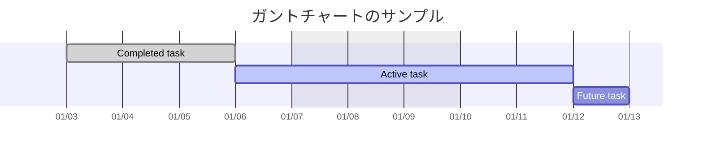

その他の設定内容などはドキュメントをご覧ください。
https://mermaid-js.github.io/mermaid/#/gantt

# フローチャート

個人的には、簡単なフローチャートは Mermaid の方が楽に書けますが、複雑なものになってくると PlantUML の方が書きやすいと感じています。
とはいえ、GitHub がサポートしたこの機会に Mermaid に統一してもいいかな、と思える程度の差です。

まずは簡単な例から。

```
graph LR
  いのき --> ボンバイエ
  ボンバイエ --> いのき
```

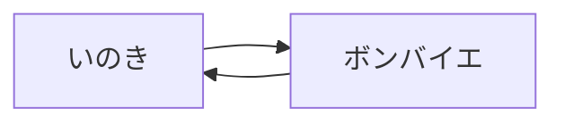

graph ではなく flowchart でも良いです。

```
flowchart LR
  いのき --> ボンバイエ
  ボンバイエ --> いのき
```


一行で書くこともできます。
[PlantUML](https://plantuml.com/) だとこれができないので行が増えがちでした。

```
flowchart LR
  いのき --> ボンバイエ --> いのき
```


`&` を使うと複数項目をまとめて書くことができます。

```
flowchart LR
  ヒロインA & ヒロインB --> 主人公
```

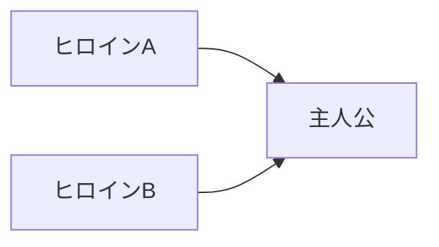

条件分岐は、項目の形を変える記法 `{}` を使って表現します。
この辺は PlantUML だと `if () then` で表現できるため (プログラマー的には) 直感的に書けたところです。

```
flowchart TD
  START-->A{アントニオ?}
  A-->|Yes|猪木
  A-->|No|B{アントキノ?}
    B-->|Yes|猪木
    B-->|No|END
```

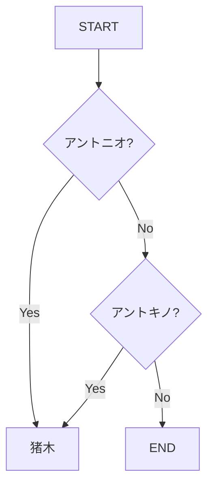

## その他

他にも機能がありますが、 個人的には Mermaid のフローチャートは 1行で書ける機能が便利だと思っており、複雑な図は書いたことがありません。

他の機能はドキュメントをご覧ください。
https://mermaid-js.github.io/mermaid/#/flowchart

# シーケンス図

シーケンス図が必要になるケースはあまりないのですが、規模が大きく複雑な実装を紐解いていく時には重宝しています。
Mermaid のシーケンス図はかなり見やすいと思います。

まずは簡単な例。

```
sequenceDiagram
  autonumber
  Client->>+Server: GET /issues
  Server-->>-Client: response
```

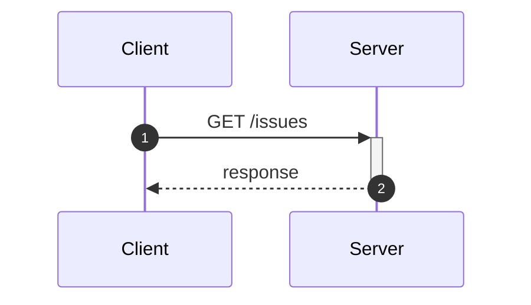

番号がついており、シーケンス図を見慣れていない人でもどこから見ていけば良いのか分かりやすくて良いです。
非同期処理やループも表現できます。

```
sequenceDiagram
  autonumber
  Client->>+Server: GET /issues
  Server--)Server2: 非同期リクエスト
  Server-->>-Client: response
  loop
    Server2-->Server2: なにかしら
  end
```

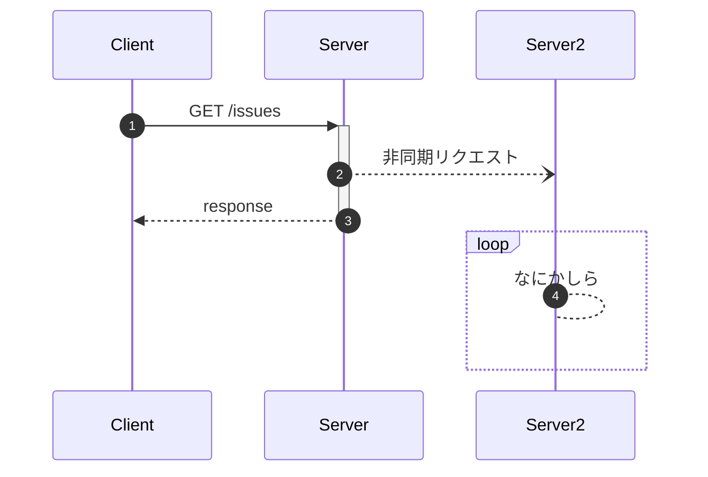

注釈も添えられます。
テキストは `<br/>` で改行できます。

```
sequenceDiagram
  autonumber
  Client->>+Server: GET /issues
  Server--)Server2: 非同期リクエスト
  Server-->>-Client: response
  loop
    Server2-->Server2: なにかしら
    Note right of Server2: 処理が完了しなくても<br/>10秒で強制終了する
  end
```

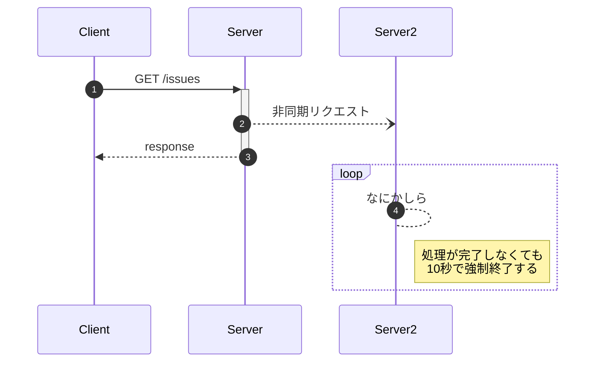

## その他

`actor` で人形のアイコンも使えます。
デフォルト値の `participant` と `actor` 以外はありませんが十分だと思います。

```
sequenceDiagram
  actor User
  User ->> モニター: 暗証番号を入力
```

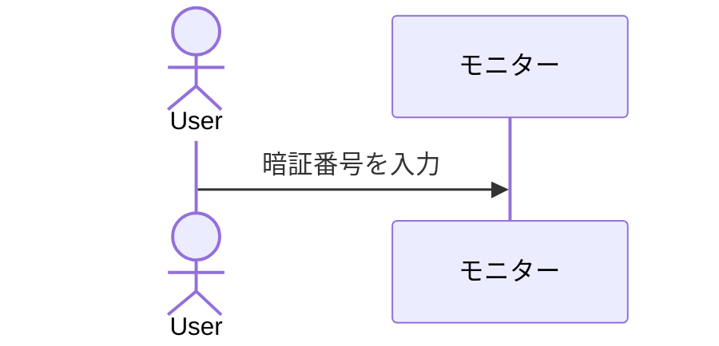

他の記法もあるのでドキュメントをご覧ください。
https://mermaid-js.github.io/mermaid/#/sequenceDiagram

# 思ったとおりにいかない...と思った時は

ブラウザの DevTool のコンソールログにヒントがある...場合がありますが、 Mermaid のドキュメントや[ソースコード](https://github.com/mermaid-js/mermaid) を読むのが一番確実かと思います。

# まとめ

今まで Markdown にテキストを大量に書いていたり、他のツールで図を書いて添付していたところが、 Mermaid によって簡単に可視化できるようになりました。
記法が独特なので慣れるまで大変かもしれませんが、今は [Live Editor](https://mermaid-js.github.io/mermaid-live-editor) という Mermaid を試す便利ツールもあるので、とにかく手を動かしてみると良いと思います。

この記事が Mermaid を触ってみようと思うきっかけになれば幸いです。

